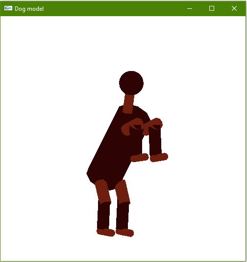

# OpenGL
It contains 3 projects. In the first one, some curve maipulation is happenning. Specifically, in the first case, click 4 times and a cubic interpolation curve will be drawn. In the second case, click 5 times and a 5th degree Bezier curve will be drawn with the first and the sixth control point being the same. In the third case, two C1 cubic Bezier curves are drawn. In the last case, a bicubic Bezier surface is drawn with the four control points on the edges being on the vertices of a square. In the first 3 cases, you can move the control points and the curves are changing. In the second one, I constructed an articulate hierarchical model of an animal, which accomplishes predefined moves. In the third one, particles are generated from a specific point with random initial velocity, which are bouncing on a plane and the collision is either elastic or inelastic.

Particle System

Case 1

Case 2

Case 3

Case 4

Drop down menu

Hierachical Model

